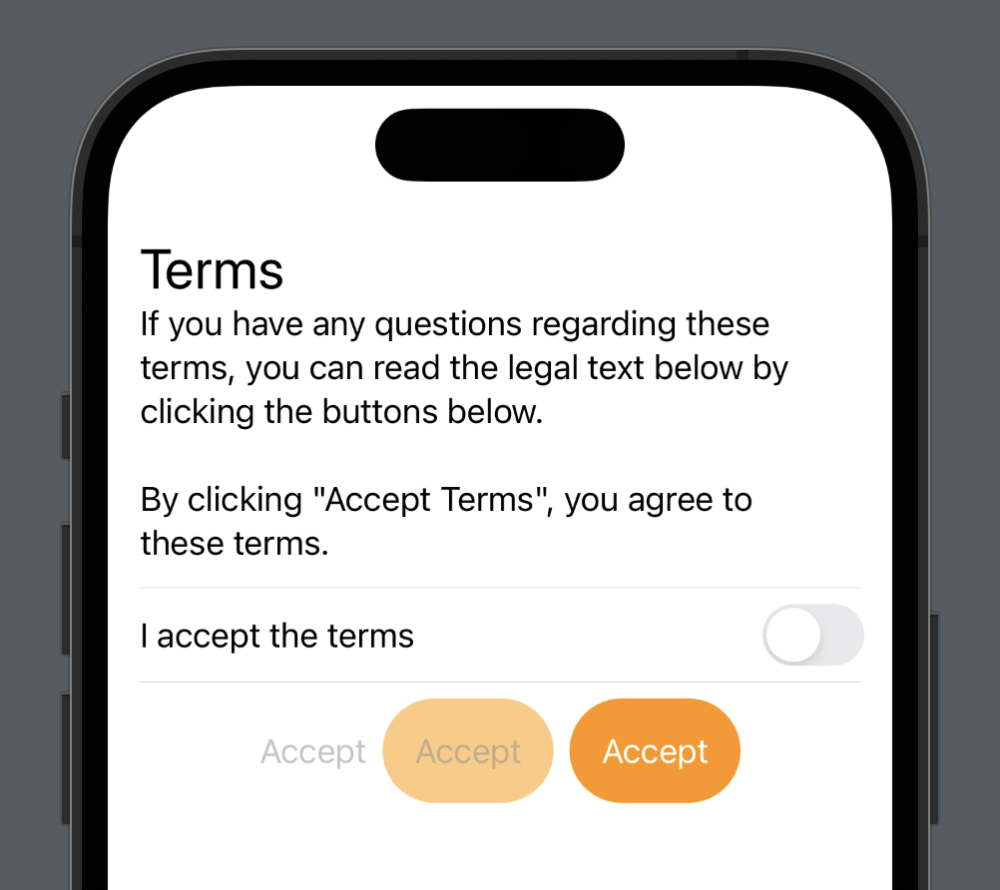

# SwiftUI: Environment property. You should use it!

This is a code from the YT video "SwiftUI: Environment property. You should use it!" 🤗

You will learn how to use the Environment property in SwiftUI. Enjoy 🤓

## Links:
- [Link to the video](https://www.youtube.com/watch?v=P3qYC9xP0Y8)
- [Environment](https://developer.apple.com/documentation/swiftui/environment)
- [isEnabled](https://developer.apple.com/documentation/swiftui/environmentvalues/isenabled)